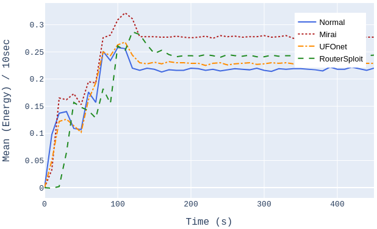
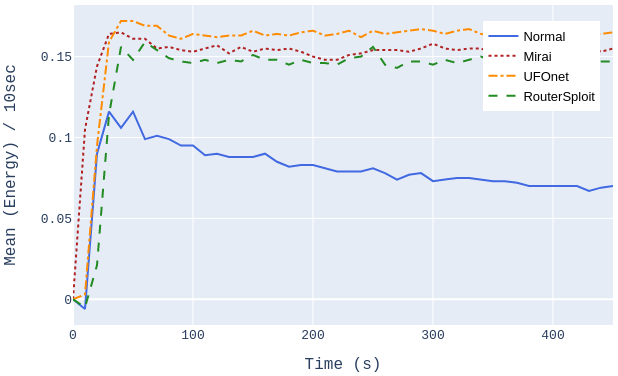
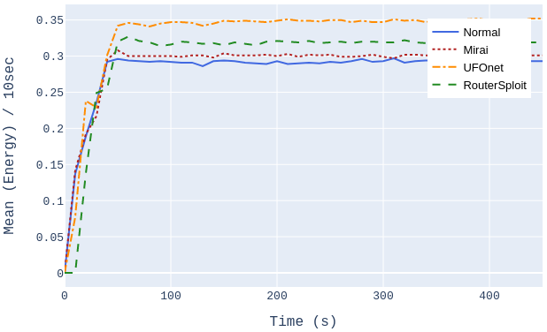

# Compromised-IoT-Devices
This repository is created to show a sample of the data used in research work to identify compromised iot devices.

Dans cet etude nous avons applique 3 type d'attaques qui sont connue dans les attaques des IoT devices (Mirai, UFOnet, RouterSploit).

Nous avons utiliser 6 IoT devices qui sont detaille dans le tableau suivant:

|             Devices             |            Model           |
|:-------------------------------:|:--------------------------:|
| (1) Indoor Smart Home Camera    | Wyze Cam WYZEC             |
| (2) Outdoor Camera              | HOSAFE Outdoor Wifi Camera |
| (3) Home Router (1)             | TP-Link ACS1750            |
| (4) Home Router (2)             | D-Link AC1200              |
| (5) Smart Home Hub              | Phillips Hue Smart Hub     |
| (6) DVR Digital Video Recorder  | ANNKE DVR 8CH              |

Nous avons collecter deux type de donnee (Network Traffic, Energy consumption). Les metrique utilise dans ce travail sont detaille dans le tableau suivant:

|     Tool      | Feature         | Description                                                                       |
|:-------------:|-----------------|-----------------------------------------------------------------------------------|
|     Wireshark | No. packets     | The number of packets in order of arrival                                         |
|               | Source          | The source address of a packet ( it can be either the IP or the MAC address)      |
|               | Destination     | The destination address of a packet ( it can be either the IP or the MAC address) |
|               | Protocol        |  The protocol type of a packet e.g., TCP, UDP, etc                                |
|               | Length          | The size of a packet in Bytes                                                     |
| Energy        |  Monitor Value  | The reading/measurement value in Amps                                             |

Pour chaque composant, nous avons collecter les metriques dans l'etat d'attaque ainsi que dans l'etat normal pour une periode de 30 minutes.

Dans les figure suivante, nous explorant l'energy consumption dans l'etat normal et pour les compromised situation:

In the following we are going to show an example of the dataset with normal and with Mirai attack.
 
Un exemple de data est fournit dans le folder dataset.

Nous avons fait un statistical test P-value of Mann-Whitney U test and effect size.
Le script est fournit dans le dossier src.

## Reference

Ce travail a ete publie dans QRS 2021:

<a href="https://bit.ly/3HdRqra" target="_blank">Link to the paper</a>

BibTex:

@article{qrs2021-iot,
 author = {Fehmi Jaafer and Darine Ameyed and Amine Barrak and Mohamed Cheriet},
 
 title = {Identification of Compromised IoT Devices: Combined Approach Based on Energy Consumption
and Network Traffic Analysis},

 booktitle = {Proceedings of the 2021 IEEE International Conference on Software Quality, Reliability and Security (QRS)},
 
 year = {2021},
 
 month = {Decenber},
 
 address = {Hinan, China},
 
 notes = {To appear},
}

